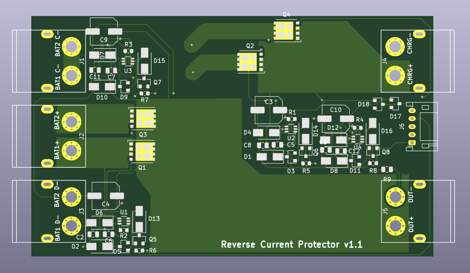

# Reverse-Current-Protection-Board
A Reverse Current Protection Board that allows the safe paralell usage of two Battery packs with different capacities.

## What it does

I developed this board because I wanted to use two 10S5P battery packs with different cells in paralell. Each of the packs has it's own BMS with seperate charge and discharge negative pole. This board takes care that the two packs do not charge and discharge each ohter. It also allows the enableing and disableing of the charing and discharging of each pack.

## Electrical limits
This board is designed for a maximal load of 55A on the discharge output when it is
fabricated with 70µm (2oz) of copper. It can be used up until a 14s (48V) battery packs.

